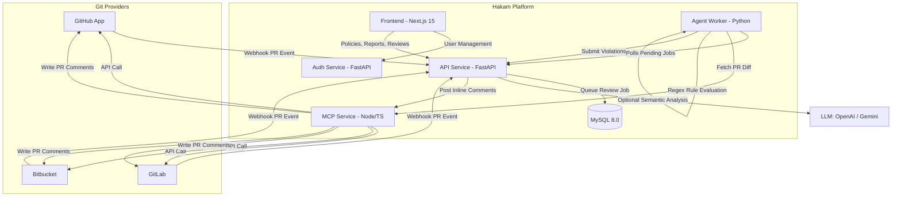

<div align="center">
  
  <h1>Hakam (حَكَم)</h1>
  <p><strong>The Open-Source AI-Powered Pull Request Reviewer & Policy Enforcement Platform</strong></p>

  <p>
    <a href="https://github.com/hattabgroup/hakam-agent/blob/master/LICENSE"></a>
    <a href="https://github.com/hattabgroup/hakam-agent/actions"></a>
    <a href="https://github.com/hattabgroup/hakam-agent/pulls"></a>
    <a href="https://hub.docker.com"></a>
    <a href="#quickstart"></a>
  </p>

  <p>
    <a href="#-overview">Overview</a> •
    <a href="#-key-features">Features</a> •
    <a href="#%EF%B8%8F-system-architecture">Architecture</a> •
    <a href="#-quickstart">Quickstart</a> •
    <a href="#%EF%B8%8F-configuration">Configuration</a> •
    <a href="#-integrations">Integrations</a> •
    <a href="#-contributing">Contributing</a>
  </p>
</div>

---

## 📖 Overview

**Hakam** (*Arabic for "Referee" or "Arbitrator"*) is a self-hostable, automated code review and policy enforcement platform. It integrates directly into your Git workflow (GitHub, GitLab, Bitbucket), analyzes pull request diffs, checks them against customized security and engineering policies, and posts inline review feedback — powered by regex AST rules and state-of-the-art LLMs (OpenAI GPT-4o, Google Gemini).

Unlike closed-source SaaS review tools, Hakam runs entirely on your own infrastructure: **your code, diffs, and IP never leave your control**.

---

## ✨ Key Features

- 🤖 **Dual-Engine Review**:
  - **Fast Rule Engine**: Immediate regex and pattern-matching checks for hardcoded credentials, forbidden APIs, and anti-patterns.
  - **Semantic AI Engine**: Deep pull request contextual reasoning via OpenAI (GPT-4o) or Google Gemini.
- 📜 **Custom Policy Categories**: Group rules by Security, Performance, Coding Standards, Architecture, or Compliance.
- 🔌 **Multi-Provider Support**: Seamless native integration with **GitHub** (GitHub App), **GitLab** (OAuth & Webhooks), and **Bitbucket**.
- 📊 **Engineering Metrics & Reports**: Track recurring policy violations, top violation types, and team compliance trends over time.
- 🛡️ **100% Self-Hostable & Privacy-First**: Deploy locally or in your private VPC using Docker Compose.
- ⚡ **Asynchronous Background Processing**: Scalable worker model ensures webhooks return in milliseconds while diff analysis runs asynchronously.

---

## 🏛️ System Architecture



### Microservice Components
1. **Frontend (`frontend`)**: Modern Next.js 15 dashboard built with Tailwind CSS for policies, violation tracking, reports, and review histories.
2. **API Service (`api-service`)**: Core FastAPI backend handling repository management, policies, webhooks, and review orchestration.
3. **Auth Service (`auth-service`)**: Independent auth microservice handling JWTs, user verification, and password resets.
4. **MCP Service (`mcp-service`)**: Gateway service providing unified abstraction over GitHub, GitLab, and Bitbucket APIs.
5. **Agent Service (`agent-service`)**: High-throughput background worker executing pattern rules and diff evaluations.

---

## 🚀 Quickstart

Get Hakam up and running locally in 3 simple steps:

### 1. Clone the repository
```bash
git clone https://github.com/hattabgroup/hakam-agent.git
cd hakam-agent
```

### 2. Configure environment
```bash
cp .env.example .env
```
*(The default `.env.example` comes pre-configured with local development credentials out of the box).*

### 3. Launch with Docker Compose
```bash
cd infra
docker compose up -d
```

Open your browser at **`http://localhost:3000`** to create your admin account and start enforcing policies!

---

## ⚙️ Configuration & Environment Variables

Key environment variables in `.env`:

| Variable | Description | Default / Example |
| :--- | :--- | :--- |
| `DATABASE_URL` | MySQL connection string | `mysql+pymysql://hakam_user:hakam_password@db/hakam_db` |
| `JWT_SECRET` | Secret key for JWT signing | `change_to_a_random_32_char_secret` |
| `TOKEN_ENCRYPTION_KEY` | 32-byte Base64 key for storing provider tokens | Generated via `openssl rand -base64 32` |
| `INTERNAL_WORKER_SECRET`| Shared secret between API and Agent Worker | `secure_worker_secret` |
| `BILLING_ENABLED` | Enable SaaS Stripe billing (`false` for Community) | `false` |
| `EMAIL_VERIFICATION_REQUIRED` | Require email verification (`false` to auto-verify) | `false` |
| `LLM_PROVIDER` | AI provider for semantic reviews (`openai` / `gemini`) | `openai` |
| `LLM_API_KEY` | API Key for OpenAI or Google Gemini | `sk-...` / `AIzaSy...` |
| `SMTP_HOST` | SMTP server for verification & reset emails | `smtp.example.com` (optional) |
| `GITHUB_APP_ID` | GitHub App ID for GitHub integration | (optional) |
| `GITLAB_CLIENT_ID` | GitLab OAuth Client ID | (optional) |

---

## 🔌 Integrations

### 1. GitHub App Setup
1. Create a GitHub App in your GitHub organization settings.
2. Grant **Repository Permissions**:
   - `Pull Requests`: Read & Write (to inspect diffs and post review comments).
   - `Metadata`: Read-only.
3. Subscribe to webhook events: `Pull request`.
4. Set the Webhook URL to: `https://<your-domain>/webhooks/github`.
5. Set `GITHUB_APP_ID`, `GITHUB_APP_CLIENT_ID`, `GITHUB_APP_CLIENT_SECRET`, and `GITHUB_APP_PRIVATE_KEY` in `.env`.

### 2. GitLab Setup
1. Create an Application in GitLab User/Group Settings.
2. Redirect URI: `http://localhost:3000/dashboard/integrations/gitlab-callback` (or your domain).
3. Scopes: `api`, `read_user`, `read_repository`.
4. Populate `GITLAB_CLIENT_ID` and `GITLAB_CLIENT_SECRET` in `.env`.

---

## 🤝 Contributing

We welcome contributions from developers of all skill levels! Please see our [CONTRIBUTING.md](CONTRIBUTING.md) for guidelines on:
- Setting up the local dev environment
- Coding standards & conventions
- Running test suites
- Submitting Pull Requests

Please also review our [Code of Conduct](CODE_OF_CONDUCT.md).

---

## 🛡️ Security

If you discover a security vulnerability in Hakam, please review our [Security Policy](SECURITY.md) or email ahmad@hattabgroup.com directly instead of filing a public issue.

---

## 📄 License

Hakam is open-source software licensed under the [Apache License 2.0](LICENSE).
